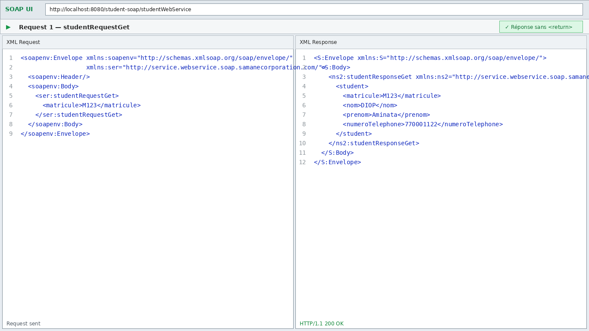
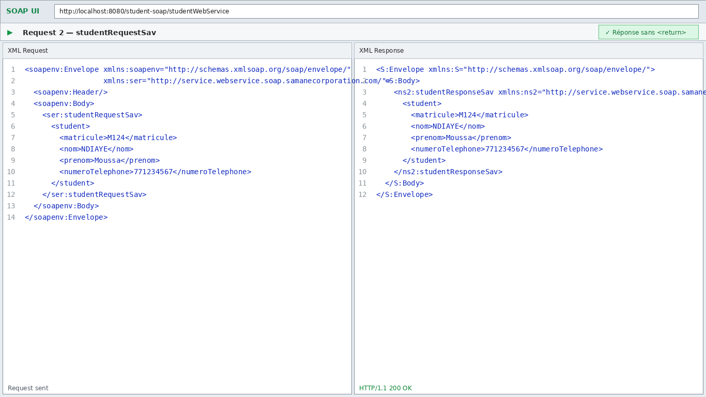
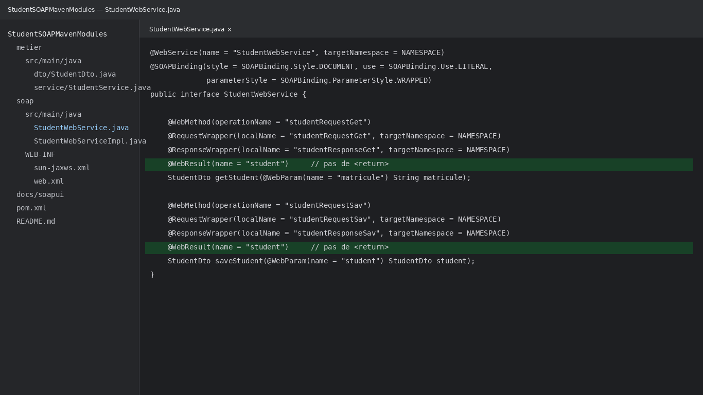

# Student SOAP Maven Modules — Énoncé 3

Application SOAP Java réalisée à partir de l'architecture du dépôt modèle :

- https://github.com/ngorseck/SOAPMavenModules/tree/main

Le projet conserve le principe **Maven multi-modules** avec :

- un module `metier` pour les données, Hibernate, DAO et services ;
- un module `soap` de type WAR pour le Web Service JAX-WS ;
- Java 17 ;
- Tomcat 10 ;
- Maven 3.9.x recommandé ;
- MySQL ;
- SoapUI pour les tests.

---

## 1. Objectif du devoir

Les deux contraintes principales de l'énoncé sont respectées.

### 1.1 Requête de recherche

Le corps métier doit avoir cette forme :

```xml
<studentRequestGet>
    <matricule>M123</matricule>
</studentRequestGet>
```

### 1.2 Requête d'enregistrement

```xml
<studentRequestSav>
    <student>
        <matricule>M123</matricule>
        <nom>DIOP</nom>
        <prenom>Aminata</prenom>
        <numeroTelephone>770001122</numeroTelephone>
    </student>
</studentRequestSav>
```

> Remarque : l'énoncé contient parfois `maticule`. Le projet utilise volontairement l'orthographe cohérente `matricule`, comme dans la fermeture de balise et dans l'image de référence.

### 1.3 Aucune balise `<return>`

La réponse n'utilise pas :

```xml
<return>...</return>
```

Elle utilise directement :

```xml
<student>...</student>
```

---

## 2. Structure du projet

```text
StudentSOAPMavenModules/
├── pom.xml
├── metier/
│   ├── pom.xml
│   └── src/main/
│       ├── java/com/samanecorporation/metier/
│       │   ├── config/
│       │   │   ├── HibernateUtil.java
│       │   │   └── PropertiesReader.java
│       │   ├── dao/
│       │   │   ├── IStudentDao.java
│       │   │   └── StudentDao.java
│       │   ├── dto/
│       │   │   └── StudentDto.java
│       │   ├── entity/
│       │   │   └── StudentEntity.java
│       │   ├── mapper/
│       │   │   └── StudentMapper.java
│       │   └── service/
│       │       ├── IStudentService.java
│       │       └── StudentService.java
│       └── resources/
│           └── database.properties
├── soap/
│   ├── pom.xml
│   └── src/main/
│       ├── java/com/samanecorporation/soap/webservice/service/
│       │   ├── StudentWebService.java
│       │   └── StudentWebServiceImpl.java
│       └── webapp/
│           ├── index.jsp
│           └── WEB-INF/
│               ├── web.xml
│               └── sun-jaxws.xml
├── sql/
│   └── studentsoap.sql
└── docs/
    ├── screenshots/
    ├── soapui/
    └── wsdl/
```

---

## 3. Architecture

```text
SoapUI
   │
   │ SOAP / XML
   ▼
StudentWebService
   │
   ▼
StudentWebServiceImpl
   │
   ▼
StudentService
   │
   ▼
StudentDao
   │
   ▼
Hibernate
   │
   ▼
MySQL / studentsoap_db
```

Le module `soap` dépend du module `metier` grâce à Maven.

---

## 4. Modèle étudiant

Un étudiant possède :

| Champ | Type | Exemple |
|---|---|---|
| `matricule` | String | `M123` |
| `nom` | String | `DIOP` |
| `prenom` | String | `Aminata` |
| `numeroTelephone` | String | `770001122` |

Le matricule est la clé primaire de la table `student`.

---

## 5. Base de données

### 5.1 Créer la base

Exécuter :

```sql
CREATE DATABASE IF NOT EXISTS studentsoap_db;
```

Le fichier complet est disponible dans :

```text
sql/studentsoap.sql
```

Il crée aussi la table et un étudiant de test `M123`.

### 5.2 Configuration Hibernate

Modifier si nécessaire :

```text
metier/src/main/resources/database.properties
```

Configuration fournie :

```properties
database.driver=com.mysql.cj.jdbc.Driver
database.url=jdbc:mysql://localhost:3306/studentsoap_db?useSSL=false&allowPublicKeyRetrieval=true&serverTimezone=UTC
database.username=root
database.password=
hibernate.dialect=org.hibernate.dialect.MySQLDialect
hibernate.show_sql=true
hibernate.format_sql=true
hibernate.hbm2ddl.auto=update
```

Si votre compte MySQL possède un mot de passe, renseignez `database.password`.

---

## 6. Contrat SOAP

Le fichier principal est :

```text
soap/src/main/java/com/samanecorporation/soap/webservice/service/StudentWebService.java
```

### 6.1 Pourquoi `studentRequestGet` est généré correctement ?

```java
@WebMethod(operationName = "studentRequestGet")
@RequestWrapper(
    localName = "studentRequestGet",
    targetNamespace = NAMESPACE
)
StudentDto getStudent(
    @WebParam(name = "matricule", targetNamespace = "") String matricule
);
```

`@WebMethod` définit le nom de l'opération.

`@RequestWrapper` impose le nom de l'élément enveloppant du corps SOAP.

`@WebParam` impose le nom `matricule`.

---

## 7. Suppression de `<return>`

C'est la modification la plus importante du devoir.

Une méthode JAX-WS peut produire par défaut une balise nommée `return` pour son résultat.

Le projet impose explicitement :

```java
@WebResult(name = "student", targetNamespace = "")
```

Exemple complet :

```java
@WebMethod(operationName = "studentRequestGet")
@RequestWrapper(localName = "studentRequestGet", targetNamespace = NAMESPACE)
@ResponseWrapper(localName = "studentResponseGet", targetNamespace = NAMESPACE)
@WebResult(name = "student", targetNamespace = "")
StudentDto getStudent(
    @WebParam(name = "matricule", targetNamespace = "") String matricule
);
```

Ainsi la réponse contient :

```xml
<student>
    ...
</student>
```

et non :

```xml
<return>
    ...
</return>
```

---

## 8. Opération GET

### Requête SoapUI complète

Fichier : `docs/soapui/studentRequestGet.xml`

```xml
<soapenv:Envelope xmlns:soapenv="http://schemas.xmlsoap.org/soap/envelope/"
                  xmlns:ser="http://service.webservice.soap.samanecorporation.com/">
    <soapenv:Header/>
    <soapenv:Body>
        <ser:studentRequestGet>
            <matricule>M123</matricule>
        </ser:studentRequestGet>
    </soapenv:Body>
</soapenv:Envelope>
```

### Réponse attendue

```xml
<S:Envelope xmlns:S="http://schemas.xmlsoap.org/soap/envelope/">
    <S:Body>
        <ns2:studentResponseGet xmlns:ns2="http://service.webservice.soap.samanecorporation.com/">
            <student>
                <matricule>M123</matricule>
                <nom>DIOP</nom>
                <prenom>Aminata</prenom>
                <numeroTelephone>770001122</numeroTelephone>
            </student>
        </ns2:studentResponseGet>
    </S:Body>
</S:Envelope>
```

**Il n'y a aucune balise `<return>`.**

### Capture



---

## 9. Opération SAVE

### Requête SoapUI complète

Fichier : `docs/soapui/studentRequestSav.xml`

```xml
<soapenv:Envelope xmlns:soapenv="http://schemas.xmlsoap.org/soap/envelope/"
                  xmlns:ser="http://service.webservice.soap.samanecorporation.com/">
    <soapenv:Header/>
    <soapenv:Body>
        <ser:studentRequestSav>
            <student>
                <matricule>M124</matricule>
                <nom>NDIAYE</nom>
                <prenom>Moussa</prenom>
                <numeroTelephone>771234567</numeroTelephone>
            </student>
        </ser:studentRequestSav>
    </soapenv:Body>
</soapenv:Envelope>
```

### Réponse attendue

```xml
<S:Envelope xmlns:S="http://schemas.xmlsoap.org/soap/envelope/">
    <S:Body>
        <ns2:studentResponseSav xmlns:ns2="http://service.webservice.soap.samanecorporation.com/">
            <student>
                <matricule>M124</matricule>
                <nom>NDIAYE</nom>
                <prenom>Moussa</prenom>
                <numeroTelephone>771234567</numeroTelephone>
            </student>
        </ns2:studentResponseSav>
    </S:Body>
</S:Envelope>
```

### Capture



---

## 10. Capture du code principal



Les lignes mises en évidence montrent `@WebResult(name = "student")`, qui remplace le nom de résultat par défaut.

---

## 11. Compilation Maven

Depuis le dossier racine :

```bash
mvn clean package
```

Maven compile d'abord `metier`, puis construit le WAR `soap`.

Après compilation :

```text
metier/target/metier.jar
soap/target/student-soap.war
```

---

## 12. Import dans Eclipse

1. Ouvrir Eclipse Enterprise Edition.
2. `File` → `Import`.
3. Choisir `Maven` → `Existing Maven Projects`.
4. Sélectionner le dossier `StudentSOAPMavenModules`.
5. Vérifier que les modules `metier` et `soap` apparaissent.
6. `Finish`.
7. Clic droit sur le projet → `Maven` → `Update Project`.

---

## 13. Ajouter Tomcat 10 dans Eclipse

1. Ouvrir l'onglet `Servers`.
2. `New` → `Server`.
3. Sélectionner `Apache Tomcat v10.0 Server`.
4. Indiquer le dossier d'installation de Tomcat.
5. Ajouter le module `soap` au serveur.
6. Démarrer Tomcat.

---

## 14. URL du service

Avec le WAR fourni par Maven :

```text
http://localhost:8080/student-soap/studentWebService
```

WSDL :

```text
http://localhost:8080/student-soap/studentWebService?wsdl
```

Une copie documentaire du WSDL attendu se trouve aussi ici :

```text
docs/wsdl/studentWebService.wsdl
```

---

## 15. Test avec SoapUI

1. Démarrer MySQL.
2. Démarrer Tomcat.
3. Ouvrir SoapUI.
4. `SOAP` → `New SOAP Project`.
5. Dans `Initial WSDL`, saisir :

```text
http://localhost:8080/student-soap/studentWebService?wsdl
```

6. SoapUI doit afficher les opérations :
   - `studentRequestGet` ;
   - `studentRequestSav`.
7. Copier les requêtes fournies dans `docs/soapui/`.
8. Exécuter avec le bouton vert.

---

## 16. Résultat attendu dans le WSDL

Les opérations importantes sont :

```xml
<operation name="studentRequestGet">
    ...
</operation>

<operation name="studentRequestSav">
    ...
</operation>
```

Les réponses contiennent un élément `student`, pas `return`.

---

## 17. Points importants pour la soutenance

### Question : pourquoi avoir utilisé `@RequestWrapper` ?

Pour contrôler précisément le nom de l'élément XML racine de chaque requête SOAP.

### Question : à quoi sert `@WebParam` ?

À contrôler le nom XML d'un paramètre Java dans le contrat SOAP.

### Question : comment avez-vous supprimé `<return>` ?

Avec :

```java
@WebResult(name = "student")
```

JAX-WS produit donc `<student>` comme élément de résultat.

### Question : pourquoi séparer `metier` et `soap` ?

Le module `metier` contient la logique et l'accès aux données, alors que `soap` ne s'occupe que de l'exposition du service web.

### Question : quel protocole est utilisé ?

SOAP sur HTTP avec des messages XML et un contrat WSDL.

---

## 18. Fichiers essentiels à montrer au professeur

```text
pom.xml
metier/pom.xml
soap/pom.xml
StudentDto.java
StudentEntity.java
StudentDao.java
StudentService.java
StudentWebService.java
StudentWebServiceImpl.java
web.xml
sun-jaxws.xml
database.properties
README.md
```

---

## 19. Résumé des exigences

| Exigence | Réalisation |
|---|---|
| Projet SOAP Maven multi-modules | Oui |
| Module métier | Oui |
| Module SOAP WAR | Oui |
| Java 17 | Oui |
| Tomcat 10 | Oui |
| Hibernate | Oui |
| MySQL | Oui |
| Requête `studentRequestGet` | Oui |
| Champ `matricule` | Oui |
| Requête `studentRequestSav` | Oui |
| Objet `<student>` | Oui |
| `<return>` absent | Oui |
| README | Oui |
| Exemples SoapUI | Oui |
| Captures | Oui |

---

## 20. Commandes Git

```bash
git init
git add .
git commit -m "Enonce 3 - SOAP Student Web Service"
git branch -M main
git remote add origin URL_DE_VOTRE_REPOSITORY
git push -u origin main
```

---

## 21. Note sur les captures

Les images de `docs/screenshots` reproduisent les requêtes/réponses XML finales dans une présentation de type SoapUI afin de documenter clairement le résultat attendu. Pour la remise finale, après lancement sur votre poste, vous pouvez également ajouter une capture réelle de votre instance SoapUI/Tomcat si le professeur exige la preuve d'exécution locale.
